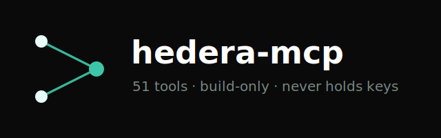

# hedera-mcp



**Comprehensive Model Context Protocol server for Hedera (Hashgraph).** Full coverage of every core Hedera service — Account, Token (HTS), Consensus (HCS), Smart Contract (EVM), File, Schedule, and Network — exposed as **51 MCP tools** any AI agent (Claude, Cursor, etc.) can call.

> **Build-only. Never holds keys.** Reads hit the public Mirror Node REST API (no auth). Writes return an *unsigned, frozen* transaction (base64) for you to sign and submit with your own wallet/SDK/CLI. This server never sees a private key and never executes anything.

---

## Why this exists

The official Hedera Agent Kit ships a preconfigured MCP server, but its tool surface is intentionally small (balance, transfer, deploy). This server fills the gap with **end-to-end coverage** of the Hedera API, organized for developer education and agent-driven onboarding — so a developer can go from "certified" to "shipping their first HTS token / HCS topic / contract" inside a single AI session.

| Service | Official starter MCP | **hedera-mcp** |
|---|---|---|
| Account | balance | create, transfer, update, delete, allowances, info, balances, NFTs |
| Token (HTS) | transfer, deploy | create FT/NFT, mint, burn, transfer, associate, freeze, KYC, pause, wipe, delete, info |
| Consensus (HCS) | — | create/update/delete topic, submit + read messages |
| Smart contract | — | deploy, execute, eth_call read, info |
| File | — | create, append, delete, info |
| Schedule | — | create, sign, delete, info |
| Network | — | tx lookup, nodes, fees, supply, exchange rate, decode |

## Security model

- **Reads** → public Mirror Node REST. No keys, no account required.
- **Writes** → the tool constructs the transaction, freezes it for offline signing, and returns base64 bytes plus a human summary. You inspect it (`hedera_decode_transaction`), then sign and submit yourself.
- The only optional environment input is `HEDERA_OPERATOR_ID` — an **account id**, used as the default payer/treasury when building. Never a key.

This mirrors the posture of [goat-network-mcp](https://github.com/ExpertVagabond/goat-network-mcp): safe to run anywhere, safe to give to an autonomous agent.

Published on npm and the [MCP Registry](https://registry.modelcontextprotocol.io) as `io.github.ExpertVagabond/hedera-mcp`.

## Install

Run directly with npx (no clone needed):

```bash
npx @purplesquirrel/hedera-mcp
```

Or from source:

```bash
npm install
npm run build
```

## Configure (Claude Desktop / Claude Code)

```json
{
  "mcpServers": {
    "hedera": {
      "command": "npx",
      "args": ["-y", "@purplesquirrel/hedera-mcp"],
      "env": {
        "HEDERA_NETWORK": "testnet",
        "HEDERA_OPERATOR_ID": "0.0.1234"
      }
    }
  }
}
```

| Env var | Default | Notes |
|---|---|---|
| `HEDERA_NETWORK` | `testnet` | `mainnet` \| `testnet` \| `previewnet` |
| `HEDERA_OPERATOR_ID` | _(unset)_ | Optional default payer/treasury **account id** (not a key) |
| `HEDERA_MIRROR_URL` | per-network | Override Mirror Node REST base (e.g. a private/HGraph node) |

## Build-only workflow

```
agent calls hedera_create_fungible_token
        │
        ▼
hedera-mcp builds + freezes the TokenCreateTransaction
        │
        ▼
returns base64 (unsigned)  ──►  you sign in HashPack / SDK / CLI  ──►  submit to Hedera
```

Inspect anything before signing:

```
hedera_decode_transaction { transactionBase64: "<bytes>" }
→ { type: "TokenCreateTransaction", transactionId, nodeAccountIds, maxTransactionFee, ... }
```

## Tool catalog (51)

**Account (8):** create_account · transfer_hbar · update_account · delete_account · approve_hbar_allowance · get_account_info · get_account_balance · get_account_nfts

**Token / HTS (18):** create_fungible_token · create_nft_collection · mint_fungible · mint_nft · burn_token · transfer_token · transfer_nft · associate_token · dissociate_token · freeze_token_account · unfreeze_token_account · grant_kyc · revoke_kyc · pause_token · unpause_token · wipe_token · delete_token · get_token_info · get_nft_info

**Consensus / HCS (6):** create_topic · submit_message · update_topic · delete_topic · get_topic_info · get_topic_messages

**Smart contract / EVM (4):** deploy_contract · execute_contract · query_contract (eth_call) · get_contract_info

**File (4):** create_file · append_file · delete_file · get_file_info

**Schedule (4):** create_schedule · sign_schedule · delete_schedule · get_schedule_info

**Network / utility (6):** get_transaction · get_network_nodes · get_exchange_rate · get_network_supply · get_network_fees · decode_transaction

## Development

```bash
npm run lint       # tsc --noEmit
npm run build      # compile to dist/
node test-smoke.mjs    # MCP stdio: live Mirror Node read + build-only write + decode
node demo.mjs          # narrated "developer's first session" walkthrough (build-only)
node test-execute.mjs  # LIVE testnet submit (needs a throwaway key in .env — see below)
```

### Live execution verification

`test-execute.mjs` proves the build-only output is real: the MCP server builds an
unsigned transaction, the harness signs it with a **throwaway testnet key from `.env`**
and submits it, then confirms the result independently via Mirror Node. The server
stays build-only the whole time — only the test harness ever touches a key.

```
HEDERA_NETWORK=testnet
HEDERA_OPERATOR_ID=0.0.xxxxxx
HEDERA_OPERATOR_KEY=302e0201...    # rotate/discard after verifying
```

Get a free testnet account at [portal.hedera.com](https://portal.hedera.com).

Built on [`@hashgraph/sdk`](https://www.npmjs.com/package/@hashgraph/sdk) and [`@modelcontextprotocol/sdk`](https://www.npmjs.com/package/@modelcontextprotocol/sdk).

## License

MIT © Matthew Karsten
